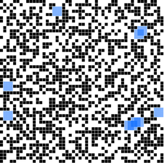
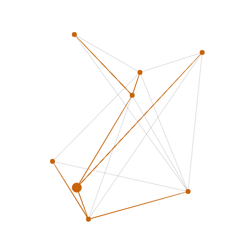
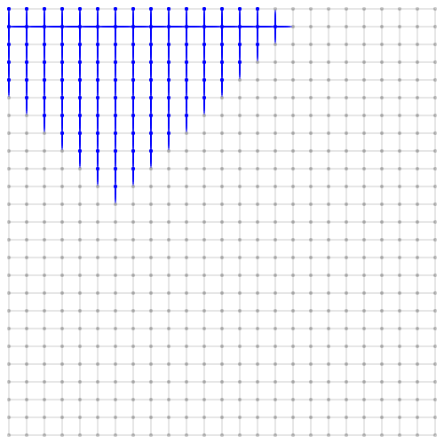
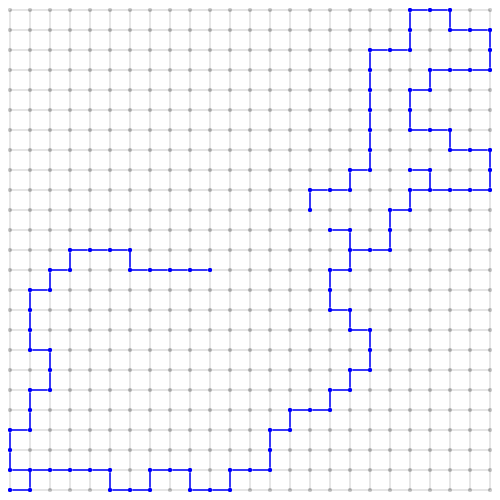
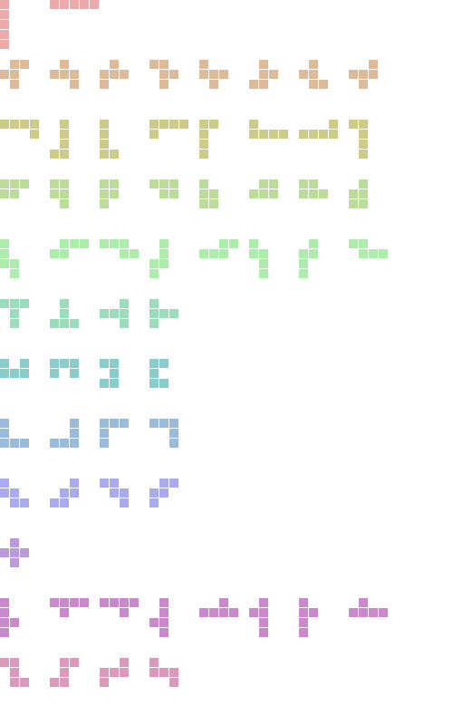
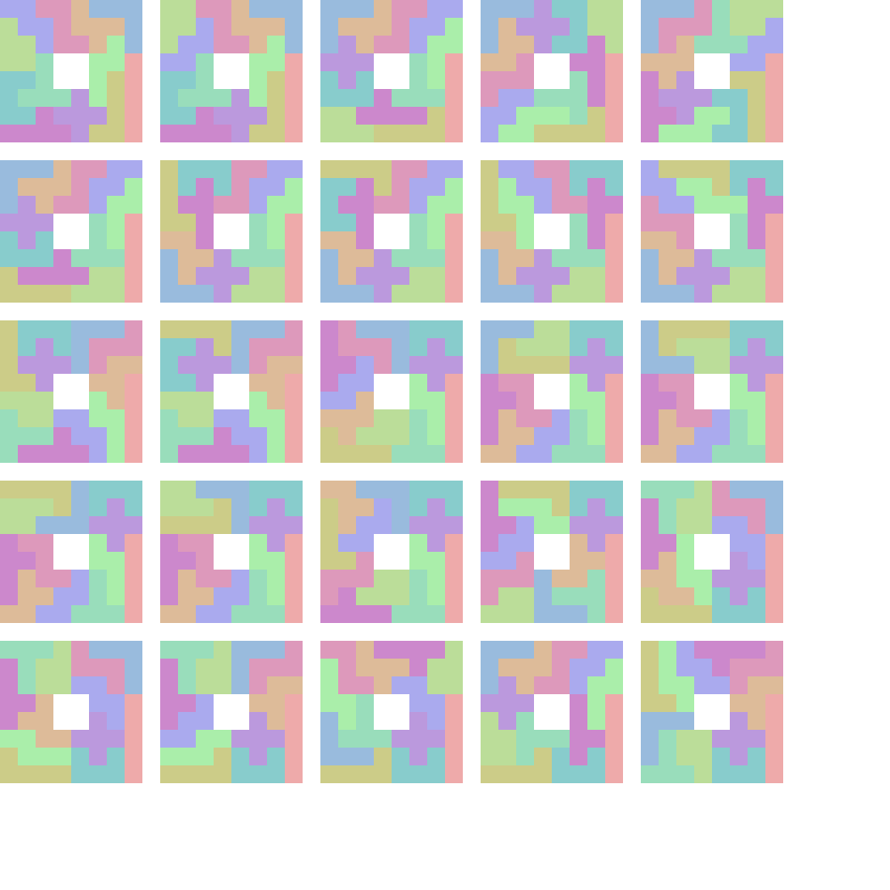

# moroccan-competitive-programmers
This repo contains visual demos of several algorithms. The aim is to help users grasp the problem/algorithm by visualizing the output. This repo is a work in progress and it will grow to contain other algorithm visualizations.

The following is a list of algorithms for which visualizations have been implemented:

## [Largest White Square in Grid](https://saadtaame.github.io/moroccan-competitive-programmers/Largest Square in Grid/LargestSquare.html)

The problem asks to find the largest (in terms of area) white square in a grid where cells can be either white or black. Here is an exapmle where the optimal squares are highlighted in light blue.

## [Single Source Shortest Paths (Non-negative Edge Weights)](https://saadtaame.github.io/moroccan-competitive-programmers/Dijkstra/Dijkstra.html)

Given a source node in a weighted graph (could be directed or undirected), find the shortest path from that node to every other node. In the demo nodes are points in the plane and the weights are the Euclidean distances between the points. The shortest paths are animated. This demo is interactive.

## [Breadth First Search](https://saadtaame.github.io/moroccan-competitive-programmers/BFS/BFS.html)

Animated demo of breadth first search. A source node is  picked at random and the BFS expansion from that source node is animated. The underlying graph is a grid.

## [Depth First Search](https://saadtaame.github.io/moroccan-competitive-programmers/DFS/DFS.html)

Animated demo of depth first search. A source node is  picked at random and the DFS expansion from that source node is animated. The underlying graph is a grid.

## [Exact Set Cover with Knuth's Dancing Links](https://saadtaame.github.io/moroccan-competitive-programmers/Exact Set Cover/DLX.html)

How many ways are there to tile a chessboard (excluding the middle 2x2 square) with pentominoes (see image below) where each pentomino must be used exactly once ? This question and several related questions can be reduced to Exact Set Cover. Given a collection of sets whose elements are chosen from a universe `U`, is there a sub-collection that partitions `U` ? These two problems may seem unrelated but there is a reduction from pentomino tiling to Exact Set Cover. Examples of other problems that can be reduced to Exact Set Cover include Sudoku and N-queens. This demo is an implementation of Knuth's `Algorithm X` applied to pentomino tiling.

 

